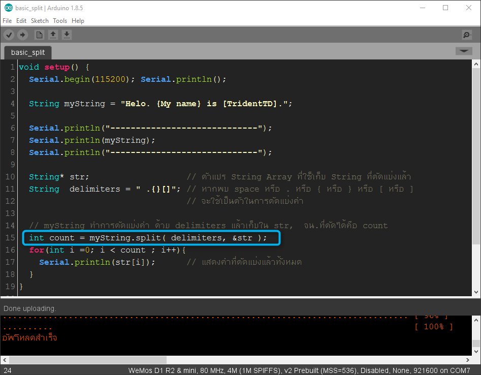
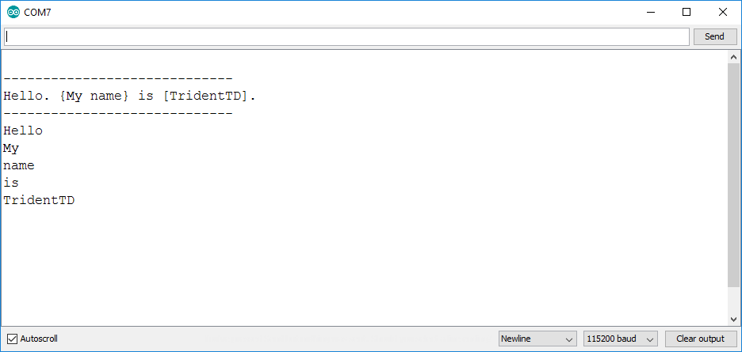
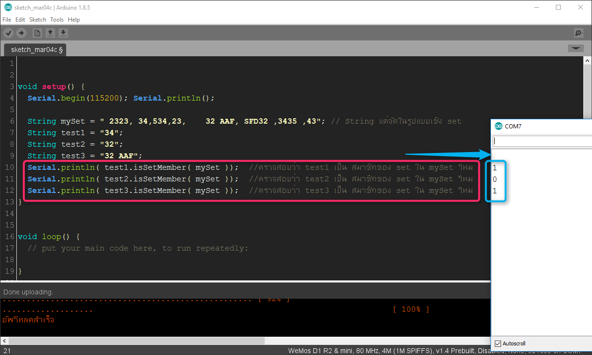
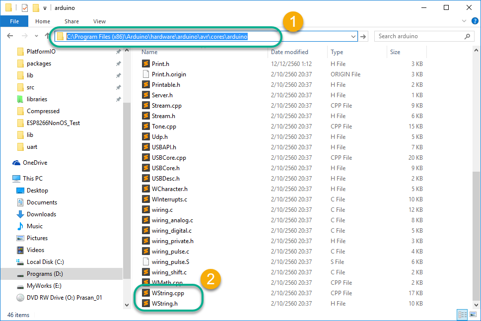
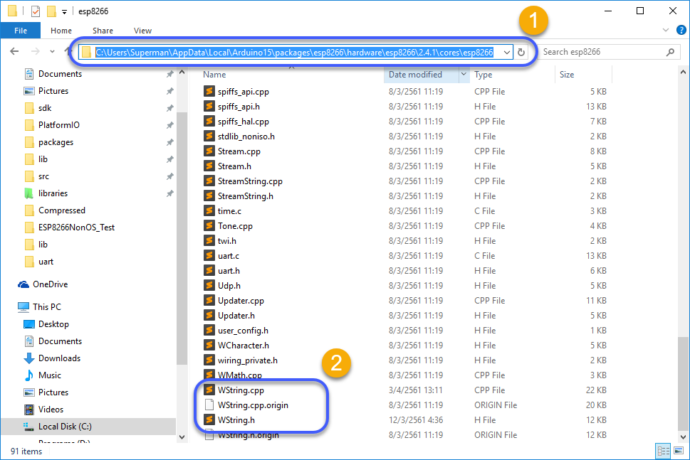

# TridentTD's String Split /  SetMember Checker / True toInt functions 
Split Arduino String to String Array  
------------------------------------  

ฟังกชั่น **td_split** เป็น ฟังกชั่นที่เพิ่มพิเศษให้ Arduino String  
เพิ่มความสามารถในการตัดแบ่งคำด้วย delimiters (ตัวตัดคำ) ที่ระบุ  
และทำการจัดเก็บลงสู่ String Array ให้อัตโนมัติ  
เพื่อสะดวกในการนำไปใช้งานต่อไป  

ตัวอย่าง
-------
คุณจะสามารถทำการตัดแบ่งคำ ได้ง่ายๆ ตามตัวอย่าง

```c
String* str;     // สร้างตัวแปร String Array ที่จะใช้เก็บ String ที่ตัดแบ่งแล้ว

void setup() {
  Serial.begin(115200); Serial.println();
  
  String myString = "Hello. {My name} is [TridentTD].";
  
  Serial.println("-----------------------------");
  Serial.println(myString);
  Serial.println("-----------------------------");

  // ตัดคำ myString ด้วย space หรือ . หรือ { หรือ } หรือ [ หรือ ] แล้วจัดเก็บใน str Array, 
  // จน.ที่ตัดได้จัดเก็บในตัวแปร count
  int count = myString.td_split( " .{}[]", &str ); 
  
  for(int i =0; i < count ; i++){
    Serial.println(str[i]);      // แสดงคำที่ตัดแบ่งแล้วทั้งหมด
  }
}

void loop() {
  delay(1);
}

// [OUTPUT]
//
// -----------------------------
// Hello. {My name} is [TridentTD].
// -----------------------------
// Hello
// My
// name
// is
// TridentTD
//
```

  



เช็คว่า String เป็น สมาชิกของ String ที่อยู่ในรูปแบบของ Set ไหม?  
------------------------------------  
บางครั้ง String ของเรา อาจจะอยู่แบบของ Set  ( set-style String )  
โดยมี comma คั่น ตัวอย่างเช่น  

```c
String mySet = " 2323, 34,534,23,    32 AAF, SFD32 ,3435 ,43"; 
```

หากเรามี 
```c
String test1 = "34"; 
```
และมีความต้องการจะทดสอบว่าเป็นสมาชิกใน set-style String ข้างต้น  
สามารถตรวจสอบได้โดยใช้คำสั่ง

```c
bool check =  test1.isSetMember( mySet ); // ทดสอบว่า test1 เป็นสมาชิกของ mySet ไหม
```

ก็จะทำให้เราสามารถตรวจสอบค่าได้อย่างรวดเร็ว  
 
  
  
## วิธีการติดตั้งสำหรับ Arduino Platform  
ในโฟลเดอร์ Arduino  
ให้สำเนา WString.h และ WString.cpp นี้ไปแทนที่ ของเดิมที่อยู่ในโฟลเดอร์   
C:\Program Files (x86)\Arduino\hardware\arduino\avr\cores\arduino  

หมายเหตุ หากมีโฟลเดอร์ ที่  
C:\Users\\[user_name]\\AppData\Local\Arduino15\packages\arduino\hardware\avr\1.6.18\cores\arduino  
ให้สำเนา WString.h และ WString.cpp ไปแทนที่ด้วย  

  


## วิธีการติดตั้งสำหรับ ESP8266 Platform  
ในโฟลเดอร์ ESP8266  
ให้สำเนา WString.h และ WString.cpp นี้ไปแทนที่ ของเดิมที่อยู่ในโฟลเดอร์   
C:\Users\\[user_name]\\AppData\Local\Arduino15\packages\esp8266\hardware\esp8266\\[esp_version]\\cores\esp8266

  

## วิธีการติดตั้งสำหรับ ESP32 Platform  
ในโฟลเดอร์ ESP32  
ให้สำเนา WString.h และ WString.cpp นี้ไปแทนที่ ของเดิมที่อยู่ในโฟลเดอร์  
[esp32_base_folder]\\hardware\espressif\esp32\cores\esp32  
.  
.  
.  
**12/12/2560 BE (2017)**  
**by Ven. Phaisarn (TridentTD)**  
